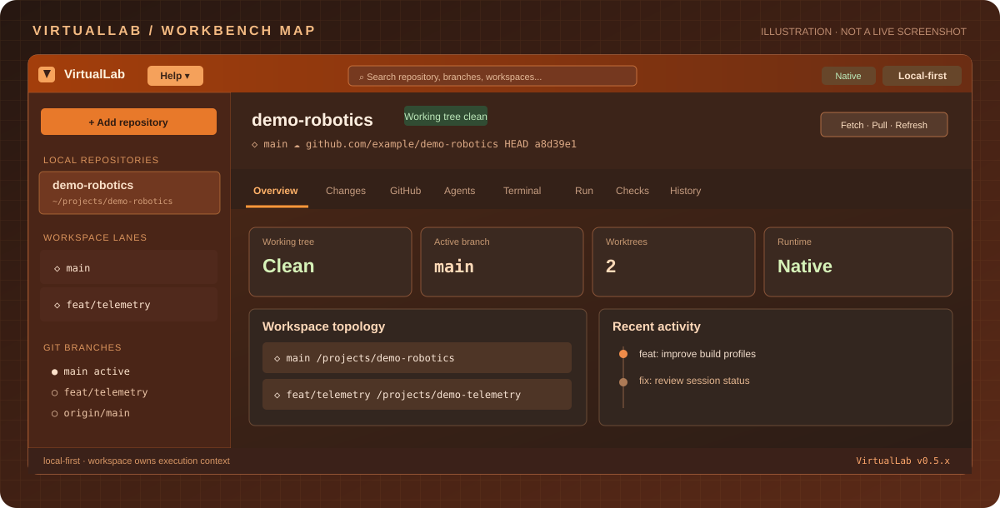
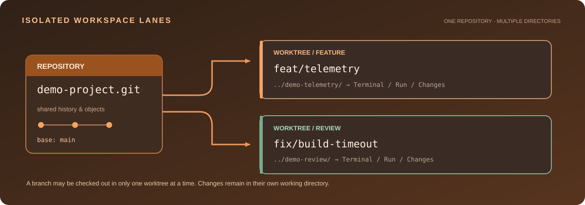
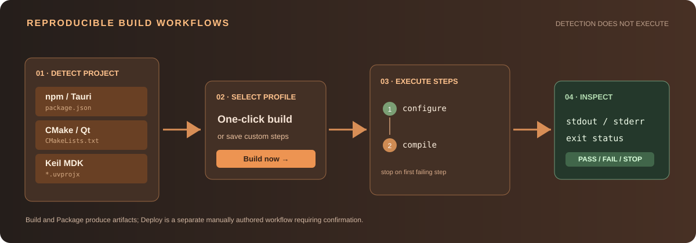
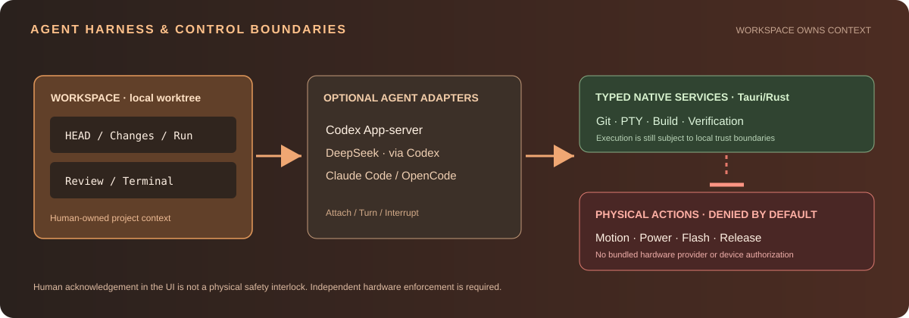

# VirtualLab 使用与集成指南

> **面向**：开发工程师、项目维护者、第三方集成商、团队评审人员。  
> **适用版本**：主线 0.5.x（以实际软件和源码为准）。  
> **程序内阅读**：GUI 顶部菜单栏 **Help → 使用文档** → 选择章节；打开独立阅读界面，不占用工作区标签，也可在未导入仓库时离线阅读。

VirtualLab 是本地优先的工程工作台：以 Git worktree 为工作单元，集成代码差异、终端、可重复构建、GitHub PR/Issue 上下文和可选 Coding Agent。**应用不绑定其他工程仓库，不包含任何硬件操作提供方或物理安全授权。**

## 01 · 工作台地图



*图 1：操作区与导航位置示意；并非某个真实仓库的运行截图。*

| 区域 | 可以做什么 | 注意 |
| --- | --- | --- |
| 应用顶部菜单栏 | **Help → 使用文档**、Native / Web preview 状态、搜索 | 文档为应用级界面，不要求先导入仓库；关闭后返回原工作区 |
| Local repositories | **Add repository** 导入现有本地 Git 项目 | 需要桌面运行时 |
| Workspace lanes | 创建、导航 Git worktree | 工作目录互相独立 |
| Git branches | 切换与删除 local/origin 分支 | 不可绕过分支保护 |
| 工作区头部 | HEAD、remote、dirty；Fetch + prune / Pull / Refresh | Pull 仅快进 |
| 功能标签 | Overview、Changes、GitHub、Agents、Terminal、Run、Checks、History | 按当前 worktree 执行；文档不在标签栏中 |
| 底部状态栏 | 本地执行边界、程序版本 | 不代替正式验收记录 |

### Repository、Workspace 与 Worktree



*图 2：同一个仓库共享提交对象，不同 Worktree 拥有独立的文件和执行目录。*

- **Repository**：已有本地 Git 仓库。
- **Worktree**：与 Git 分支关联的本地工作目录。同一个本地分支不能同时在两个 Worktree 检出。
- **Workspace**：VirtualLab 工作上下文，绑定 Worktree 的路径、Terminal、Run、Review、Agent thread 等。
- **PR/Issue**：可选外部上下文，不会自动接管 Git 工作目录。

## 02 · 安装与第一次使用

**准备工具**：Node.js 22.12+、npm、Git、Rust stable、Cargo。Windows 要有 Visual Studio C++ Build Tools / SDK / WebView2；macOS 需要 Xcode Command Line Tools；Linux 要安装 WebKitGTK 4.1 等原生开发包。详见 [本地构建指南](LOCAL_BUILD.md)。

~~~bash
git clone https://github.com/magic-alt/virtuallab.git
cd virtuallab
npm ci
npm run doctor
npm run tauri:dev
~~~

| 入口 | 能力 |
| --- | --- |
| **npm run tauri:dev** | 真正的桌面版，支持本地 Git、PTY、运行构建命令 |
| **npm run dev** | Vite Web preview，使用模拟数据，不支持真实原生操作 |
| **npm run tauri:build** | 输出可安装的独立桌面包 |

**首次使用四个步骤**：

1. 点击左侧 **Add repository** 选择已经初始化的 Git 仓库。
2. 在顶部确认分支、HEAD、remote 和工作树是否洁净，查看 **Overview**。
3. 进入 **Run** 选取自动发现的构建建议，或添加手动 Build profile。
4. 运行后检查 stdout/stderr 和退出状态，进入 **Changes** 检查本地代码差异。

> **提醒**：本机执行的构建脚本和 Agent 可能拥有本地系统权限。不要把导入仓库理解为项目安全认证；首次运行前需要审查构建脚本与依赖。

## 03 · Git Worktree 与分支管理

### 创建隔离开发工作区

1. 选中仓库，确认当前 HEAD 是预期基线。
2. 点击 **Workspace lanes → New**。
3. 选择 Base ref，输入分支名称和目标目录，确认创建。
4. 新 worktree 创建后在其中使用 Terminal、Run、Changes。
5. 需要返回时点击另一条 Workspace lane。

底层 Git 的等价示例：

~~~bash
git worktree add ../demo-feature -b feat/ui-contrast main
git worktree list
git status --short
~~~

删除 worktree 的前提是：**非 primary，工作树洁净，用户确认**。Dirty worktree 会被 Git 拒绝，不会被强制删除。

### 工作区有 Changes、无法切换分支或 Pull？

**推荐优先使用可恢复操作**：在 **Changes** 标签点击 **Save to stash**，阅读 Tauri 原生确认框后确认。此操作等价于在当前 Worktree 执行 `git stash push --include-untracked`，将未暂存、已暂存及未跟踪文件（包括 `hardware/.history/` 等工程备份）保存到 Git Stash；不会自动提交/推送、覆盖远端或删除 Git 忽略的文件。之后工作区若已变洁净，Pull 会自动恢复可用（仍为 `--ff-only`）；分支切换继续遵循 Git 自身的路径冲突保护。需要找回保存的改动时在 Terminal 执行：

```bash
git stash list
git stash show --stat 'stash@{0}'
git stash pop
```

请在正确 Worktree 与目标分支核对后再 pop；如果遇到冲突，先处理冲突再继续。

如果**确认不需要**这些修改，可分两类操作：

1. **Discard tracked** / **Discard selected tracked**：恢复对应所有或单个 Git 已跟踪文件至当前 HEAD，同时撤销它们的暂存区修改；不会删除未跟踪目录或项目备份。
2. **Delete untracked** / **Delete selected untracked**：专门移除 Git 未跟踪的文件或目录。删除目录可能永久移除多个 KiCad 历史文件，不能撤销。Git 忽略的文件不主动删除；建议先 Save to stash。

三个操作都必须先通过**原生确认框**。若按下 Cancel、确认框打不开、HEAD/分支/本地变更在确认期间发生变化，操作不会执行。操作成功会重新读取 Git 状态；如果仍有未跟踪文件，Pull 仍会维持不可用，直到工作区真正洁净。不要把工作区删除、分支强制切换或 `git reset --hard` 当作解决办法。

### 切换和删除分支

| 操作 | 作用 | 保护 |
| --- | --- | --- |
| Switch | 本地分支切换，若被另一 worktree 占用则导航到该 worktree | 未跟踪文件冲突时 Git 可拒绝 |
| Delete local | 删除未占用且符合 Git 约束的本地分支 | 需确认；保护 main/master、占用分支 |
| Delete origin | 删除 origin 远端分支 | 独立确认；保护远端默认分支；不删本地分支 |
| Fetch + prune | 同步远端跟踪引用、清理失效 tracking refs | 不合并、不重置工作区文件 |
| Pull | 快进更新当前分支 | 不执行 merge/reset |

**macOS 上点击 Delete origin 出现“git-credential-osxkeychain”密码弹窗？** 该弹窗要求的是 Mac 登录钥匙串密码，不是 GitHub 密码。原来的后台 Git push/ls-remote/fetch 可能继承钥匙串凭据助手；更新后的 macOS 桌面版在 GitHub HTTPS origin 上改用 `gh auth git-credential`，并禁用后台交互式认证弹窗。首先在 macOS **终端**完成一次 GitHub CLI 授权：

~~~bash
brew install gh
gh auth login --hostname github.com --git-protocol https
gh auth status -h github.com
git remote -v
~~~

如果 `gh` 没有安装或授权，VirtualLab 会拒绝删除并提示修复步骤，不会在后台反复弹出密码窗口。确认 GitHub 账号对 origin 仓库有删除分支权限；默认分支和受保护分支依然不能删除。**Delete origin 是服务端删除，区别于仅删除本地远端跟踪引用的 Fetch + prune。** 该配置只影响 VirtualLab 发起的 GitHub HTTPS 后台操作，不修改全局 Git 配置，不会把令牌写入仓库或命令行参数。SSH 等其他 origin 继续使用 Git 原有认证方式。

## 04 · Changes、Review、History

Monaco 提供 **Unified（上下）** 和 **Side by side（左右）** 两种只读差异布局。

| 模式 | 比较内容 | 场景 |
| --- | --- | --- |
| Worktree | 当前工作目录未暂存的已跟踪修改 | 日常自查 |
| Staged | Git index 中的暂存修改 | 提交前审查 |
| Base | 当前提交与选定基线的差异 | 分支/PR 审阅 |

对于未跟踪文件和目录，列表会显示路径/状态，但**不能直接生成已跟踪 Diff 或逐行评论**。二进制文件和过大的 diff 会给出限制提示。

**标准代码 Review Loop**：

1. 进入 Changes，选择已跟踪文件与差异模式。
2. 切换 Unified / Side by side，阅读对应源文件。
3. 选择行并保存本地评论草稿（此时不会发布到 GitHub）。
4. 在外部编辑器/终端修复后使用 **Refresh and re-review**。
5. HEAD 变化时重新检查过期（stale）草稿，确认后标记 reviewed。
6. 若需要回传 GitHub，匹配 PR HEAD 后**手动确认**发布选定草稿。

History 只展示近期 commit，Overview 展示 workspace 拓扑与 readiness。

## 05 · Run：npm、Qt/CMake、Keil 构建



*图 3：先在当前 worktree 读取项目文件，再由用户显式选择执行。*

**Run → One-click project builds** 可识别：

| 类型 | 项目依据 | 本机前提 |
| --- | --- | --- |
| npm / Tauri | package.json 脚本 | Node、npm、项目依赖 |
| CMake / Qt | CMakeLists.txt（包含 Qt） | CMake、Qt、目标编译器 |
| Keil MDK | 有界扫描的 *.uvprojx | Windows + Keil MDK |

运行方式包括 Build now / Package now，或者保存为自定义 Build/Test/Package/Deploy profile。多步骤 workflow 按顺序运行，**任何一步失败即停止**；通过结构化 program、args 和 cwd 执行，不拼接任意 Shell 字符串。自定义 profile 绑定仓库，保存在本机而不是 Git 中。

### 案例 A · npm

~~~bash
npm ci
npm run build
~~~

若 package.json 存在 build 脚本，Run 可显示相应候选构建动作。请检查输出、退出状态和项目产物。**Build passed 不代表软件已经部署。**

### 案例 B · Qt/CMake 两步 profile

以下两个步骤可分别录入 Run profile（不是整段复制进一个 program）：

~~~text
Step 1 · Configure
  program: cmake
  args: -S . -B build -DCMAKE_BUILD_TYPE=Release

Step 2 · Compile
  program: cmake
  args: --build build --config Release
~~~

先在终端验证：

~~~bash
cmake --version
cmake -S . -B build -DCMAKE_BUILD_TYPE=Release
cmake --build build --config Release
~~~

Qt 的 CMAKE_PREFIX_PATH、生成器、工具链和 MSVC/MinGW 必须按实际主机配置。不要在不同机器间照搬安装路径。

### 案例 C · Keil MDK

Windows 上的命令组成示例：

~~~text
program: C:\Keil_v5\UV4\UV4.exe
args: -b Firmware.uvprojx -j0
~~~

实际路径、工程名称和目标编译器取决于第三方工程。此构建建议**不会自动烧录、使能关节电机或操作电源**。

### Package 不等于 Deploy

- **Package**：仅生成安装包或产物。
- **Deploy**：由用户明确编写步骤，并在每次启动前单独确认。
- **Stop**：尽力取消软件进程树，不构成物理安全急停。
- **Run 日志**：主要为会话内状态，不能直接用作持久不可篡改的测试证据。

详细约束：[Project Build Workflows](PROJECT_BUILD_WORKFLOWS.md)。

## 06 · Terminal、Checks、Verification

**Terminal** 是交互式 PTY，用于 Shell、人工调试、Ctrl+C；**Run** 用于重复运行结构化步骤。**Checks** 呈现本地定义的 readiness，不代表正式产品验收。

~~~bash
git status --short
git branch --show-current
git worktree list
git log -5 --oneline
~~~

底层受限 Verification 接口支持明确允许的 build/unit/evidence 进程门，按独立调用方式存储日志和 SHA-256 metadata：

~~~text
<workspace>/.virtuallab/evidence/<run-id>/
  profile.json
  manifest.json
  <gate-id>.stdout.log
  <gate-id>.stderr.log
  import-N-<filename>  # optional
~~~

**注意**：普通 Run 并不会自动生成该目录；当前底层能力也没有提供签名不可篡改的产物注册表。HIL、soak、硬件门仍为 BLOCKED。详见 [Verification and Hardware Policy](V0.4_VERIFICATION_HARDWARE_POLICY.md)。

## 07 · GitHub PR/Issue 与 Coding Agents

### GitHub 接入

~~~bash
gh --version
gh auth login
gh auth status
~~~

GitHub 面板复用本机 gh CLI 登录态与 origin URL。离线、未登录或非 GitHub origin 的项目仍可进行本地 Changes、Run 和 Worktree 操作。

PR/Issue 可用于创建预填的 Review Worktree，但**不会自动检出远端 PR head**。需要审阅远端代码时，仍应显式确认本地 SHA、远端 SHA 与基线。发布 GitHub 评论要求明确的人类操作和 HEAD 一致性校验。

### Agent 接入



*图 4：Agent 可选择性附加，物理设备权限不会从 UI 自动推导。*

| Harness | 通信/执行模式 | 限制 |
| --- | --- | --- |
| Codex | App-server JSON-RPC | 需本机 CLI 安装和配置 |
| DeepSeek | Codex + DeepSeek Responses API | 需自行配置服务与密钥 |
| Claude Code | CLI plan/read-only | 能力依赖本机 provider |
| OpenCode | CLI plan/read-only | 能力依赖本机 provider |

从 **Agents → Check availability → Attach/resume → Role/Skills → Start turn** 发起任务，再检查事件时间线。必要时 Interrupt 或 Stop runtime。

> **重要安全边界**：人类 acknowledgement 仅记录软件决策，并非物理设备授权。VirtualLab 不包含硬件 backend；motion/power/flash/release 必须由独立硬件联锁、安全看门狗、资源授权与安全状态恢复机制实现。CLI provider 权限模式不等于 OS 沙箱。

## 08 · 三个完整实践

**实践 1 · 并行修复**：导入干净 main → 创建 feat/ui-contrast worktree → 返回 primary → 创建 fix/process-timeout worktree → 分别在 Run 构建和 Changes 审阅 → 按仓库规范自行 merge/rebase。

**实践 2 · 第三方 Qt 工程交付**：安装正确工具链 → 导入项目 → 定义 Configure / Compile 两步骤 → 检查 stdout/stderr 与构建产物 → 执行必要的人工功能测试 → 单独执行发布流程。

**实践 3 · GitHub PR 逐行审阅**：检查 gh 认证 → 选择 PR 创建工作区 → 明确获取并对齐目标 SHA → 在 Changes 中存草稿 → 修复并 Refresh and re-review → 人工确认发布选定评论。

## 09 · 常见问题

| 现象 | 检查方向 |
| --- | --- |
| Add repository 不可用 | 是否仅启动 npm run dev？需要 Tauri desktop |
| Run 找不到构建建议 | 当前 Worktree 的项目文件、脚本和支持范围；可新建自定义 Profile |
| npm / cmake 找不到 | PATH、Node / CMake 安装、同一登录用户的工具链环境 |
| Qt 配置失败 | CMAKE_PREFIX_PATH、生成器、编译器、目标平台 |
| Keil 不能编译 | Windows MDK、UV4.exe 安装位置、真实 uvprojx |
| 分支切换失败 | 其他 Worktree 占用、未跟踪文件碰撞、脏状态 |
| 本地 / origin 删除不可操作 | 是否受保护或仍被检出；远端删除需要独立确认 |
| origin 旧分支残留 | Fetch + prune 更新跟踪信息 |
| GitHub 不可用 | gh auth status、origin、网络；不影响本地审阅 |
| Draft stale | HEAD 改变，应重新加载 Diff 与评论 |
| Run Passed 但无证据 | Run 不是 Verification evidence 写入器 |

发起公共问题报告前请先删除 token、绝对私人路径、第三方客户代码和设备序列号。提供操作系统、应用版本、最小复现步骤、预期与实际行为、已去敏错误日志。

## 10 · 二次开发与文档维护

| 位置 | 职责 |
| --- | --- |
| src/features/ | React UI（包括 Guide）、Run、Review、GitHub、Agents |
| src/stores/、src/types/ | Zustand 状态及类型契约 |
| src/lib/ | typed native 调用与前端业务 |
| src-tauri/src/ | Rust Git / PTY / process / build / agent / verification |
| docs/ | 操作、架构、验收与专题资料 |
| public/help/ | 与应用一起打包的 SVG 图解 |

~~~bash
npm ci
npm run typecheck
npm test
npm run build
cargo test --locked --manifest-path src-tauri/Cargo.toml
~~~

内置帮助中心数据定义：**src/features/help/guideContent.ts**。界面实现：**HelpCenter.tsx** 和 **helpCenter.css**，SVG 图均在 **public/help/**。当功能行为变化时应同步修订应用内内容、本指南、功能专题文档与相应测试。

更多阅读：[架构](ARCHITECTURE.md) · [本地构建](LOCAL_BUILD.md) · [Review/GitHub](V0.3_REVIEW_GITHUB.md) · [Agent harnesses](V0.5_AGENT_HARNESSES.md) · [验收策略](CONTROL_ACCEPTANCE.md)。

*全部插图均是标注的概念示意，不伪装为实时产品截图。*
